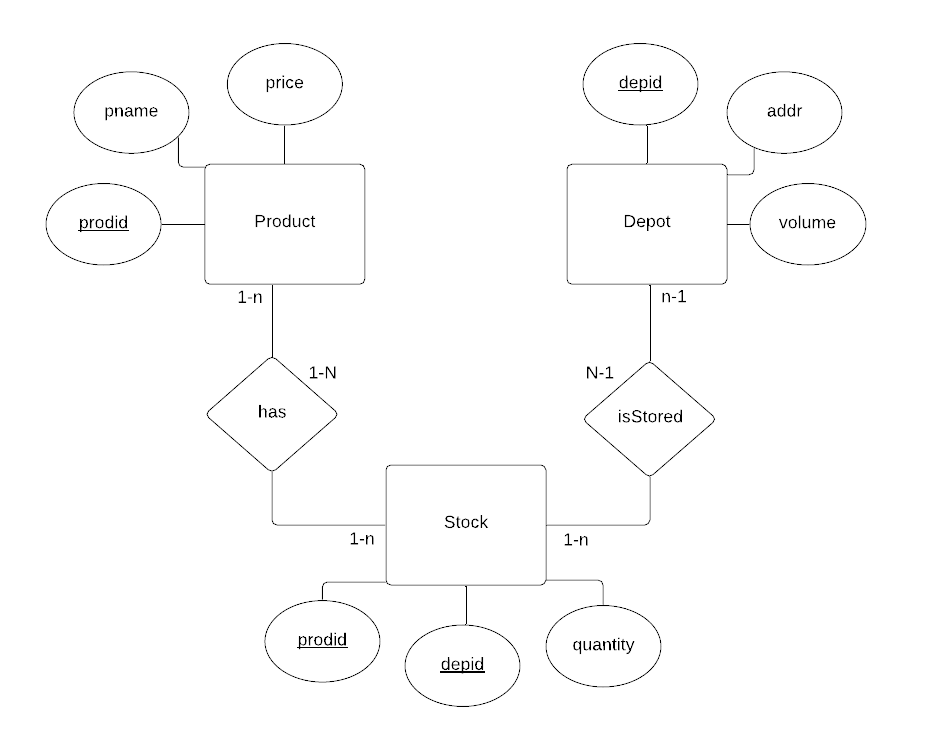

# CS6232019

This is a repo containing deliverables for our CS 623 Final Project, Group 1.

## This repo contains:

1. Our reverse engineered ERD based on the Product, Depot and Stock relations/tables implemented in previous assignments.

2. The Java code (Week 6) we wrote to implement the prompted transaction ("The product p1 is deleted from Product and Stock") using PostgreSQL and satisfying ACID properties. View [PostgreSQLDemoACID.java](https://github.com/KISS/CS6232019/blob/master/PostgreSQLDemoACID.java).

3. The code from Week 5 (SQL). View [HW5-SQL-CS623-2019-Morales.docx](https://github.com/KISS/CS6232019/blob/master/HW5-SQL-CS623-2019-Morales.docx).

4. Responses to Part 3 and Part 4 of the exercise on GitHub and Git. View [MoralesLuisaGitTutorial-07-08-2019.docx](https://github.com/KISS/CS6232019/blob/master/MoralesLuisaGitTutorial-07-08-2019.docx).

### ERD of Product, Stock, and Depot relations

## Presentation
Our presentation slides can be viewed at [https://docs.google.com/presentation/d/1pb9SHli3ppax4A9lCflI_i428xWp83d7LOu1quIwz5Y](https://docs.google.com/presentation/d/1pb9SHli3ppax4A9lCflI_i428xWp83d7LOu1quIwz5Y/edit?usp=sharing).

## Video
A 3 minute video where we walk through our slides and demo the transaction we implemented, using JAVA and PostgreSQL, can be viewed at [https://youtu.be/_kvrvqAKGkU](https://youtu.be/_kvrvqAKGkU).